# Final Drilling

- Para usar el proyecto debe instalar las dependencias: `npm install`

- Debe tomar en cuenta la configuracion de la base de datos:

```
module.exports = {
  HOST: 'localhost',
  USER: 'node_user',
  PASSWORD: 'node_password',
  DB: 'db_jwtbootcamp',
  dialect: 'postgres',
  pool: {
    max: 5,
    min: 0,
    acquire: 30000,
    idle: 10000
  }
}
```

- Una vez instalandas las dependencias podrá correr el servidor: `npm run dev`. Las rutas son las siguientes (Tambien puede realizar todas las consultas mencionadas usando el archivo de postman: m8_final_drilling.postman_collection)
  http://localhost:3000/

  - User

    - Crear Usuario: POST http://localhost:3000/api/signup (publica)
    - Iniciar Sesion: POST http://localhost:3000/api/signin (publica)
    - Ver Usuario: GET http://localhost:3000/api/user/:id (privada)
    - Ver Usuarios: GET http://localhost:3000/api/user (privada)
    - Modifcar Usuario: PUT http://localhost:3000/api/user/:id (privada)
    - Borrar Usuario: DELETE http://localhost:3000/api/user/:id (privada)

  - Bootcamp
    - Crear Bootcamp: POST http://localhost:3000/api/bootcamp (privada)
    - Agregar Usuario a Bootcamp: POST http://localhost:3000/api/bootcamp/adduser (privada)
    - Ver Bootcamp: GET http://localhost:3000/api/bootcamp/:id (privada)
    - Ver Bootcamps: GET http://localhost:3000/api/bootcamp (publica)

- Tambien puede ver los resultados de las consultas en la carpeta consultas:
  - Base de Datos: Usuarios 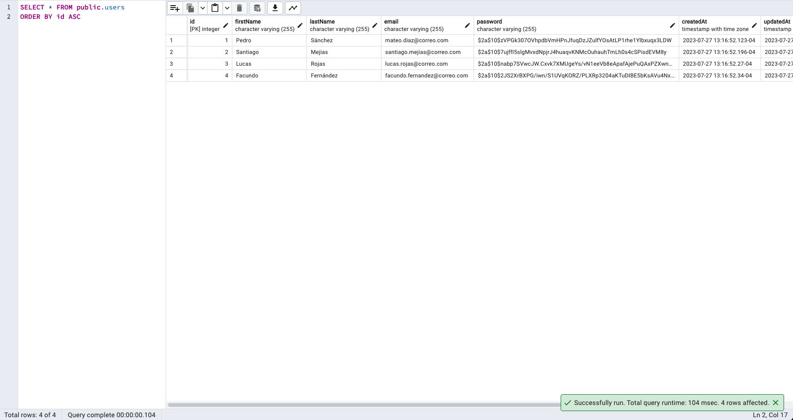
  - Base de Datos: Bootcamps 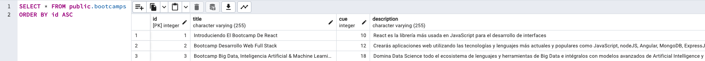
  - Base de Datos: Usuario / Bootcamps 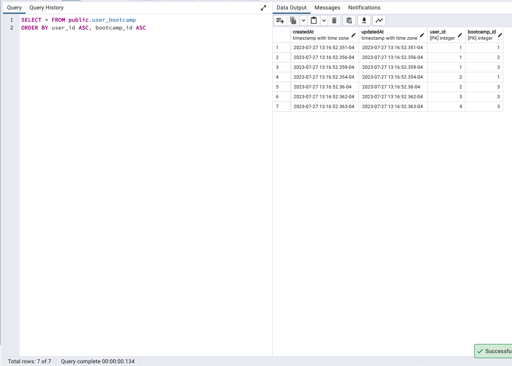
  - Registrase 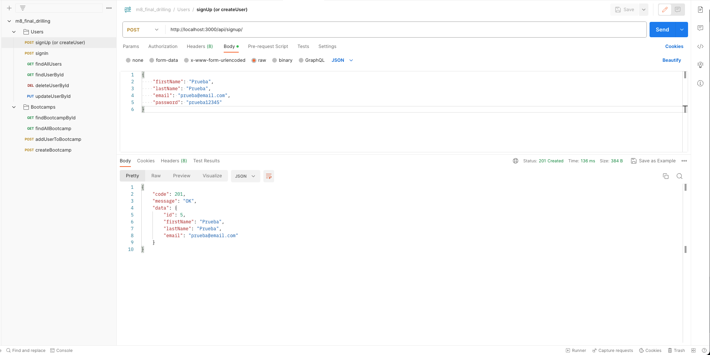
  - Registrase - Error 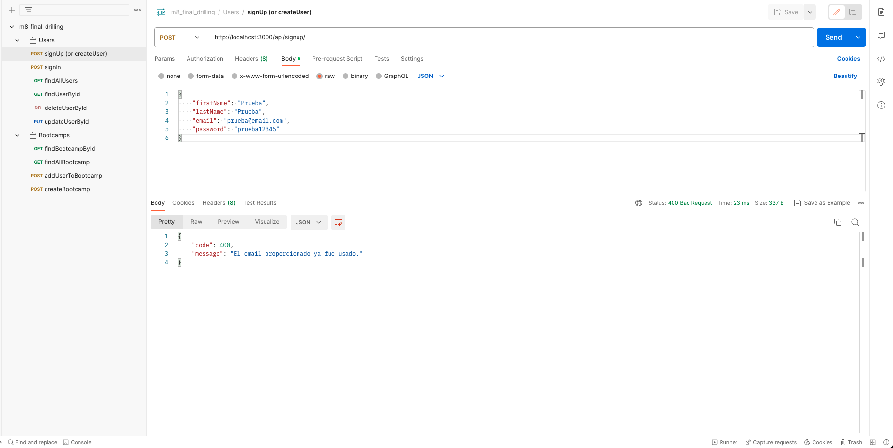
  - Iniciar Sesion 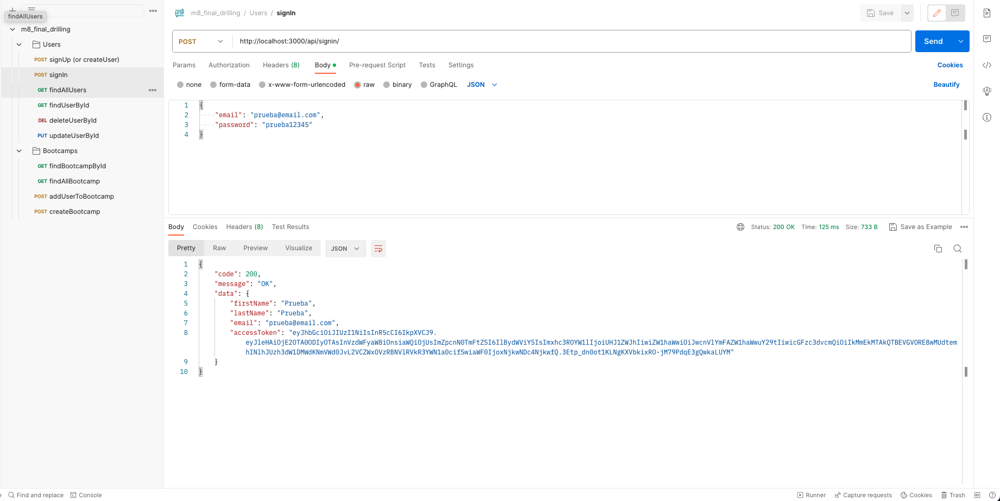
  - Ver Usuarios 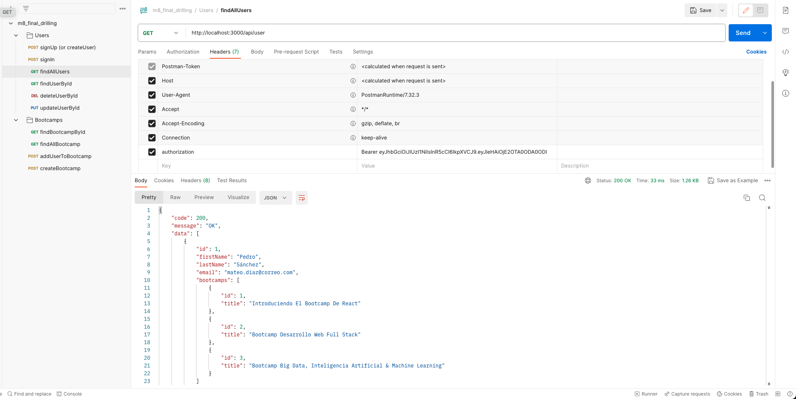
  - Ver Usuario 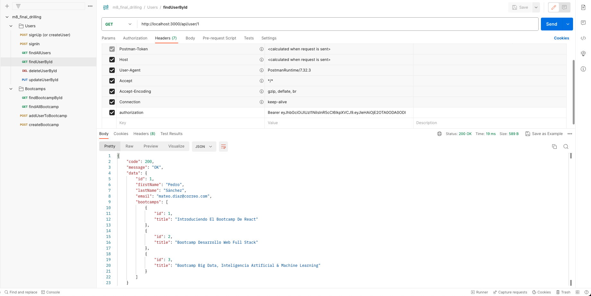
  - Modificar Usuario 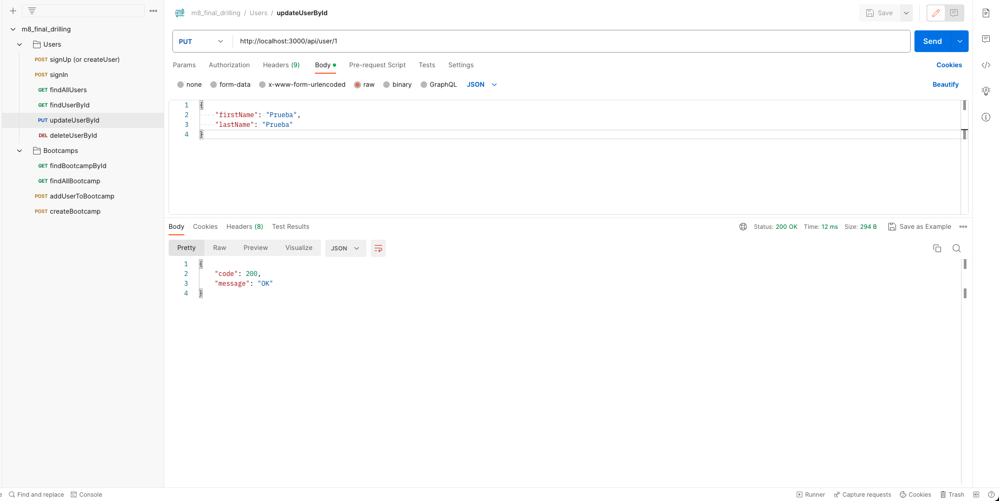
  - Eliminar Usuario 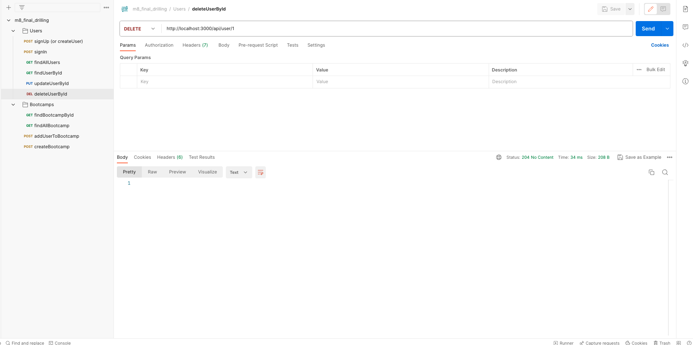
  - Ver Bootcamp 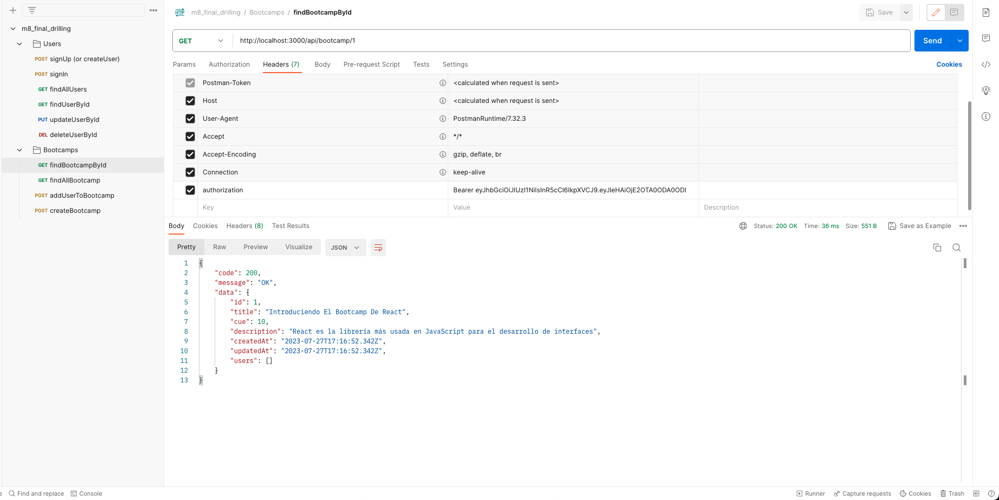
  - Ver Bootcamps 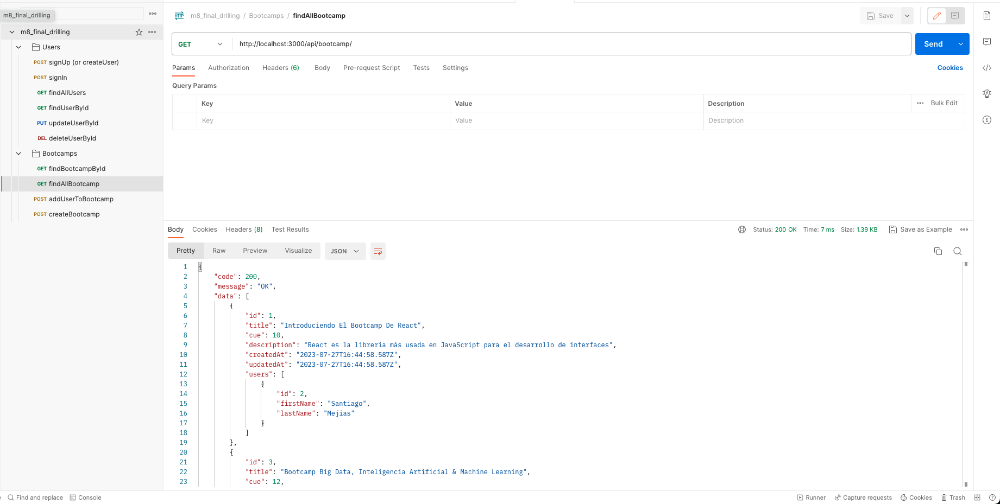
  - Agregar Usuario a Bootcamp 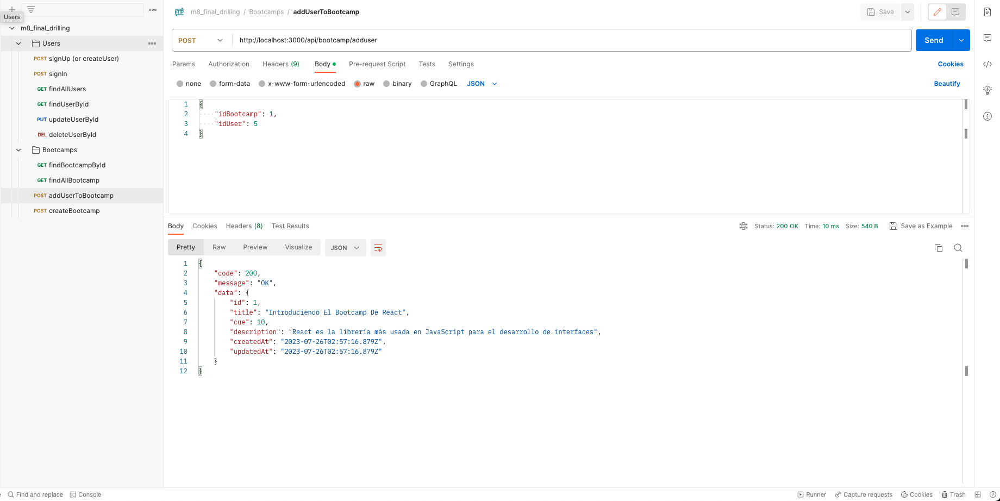
  - Agregar Bootcamp 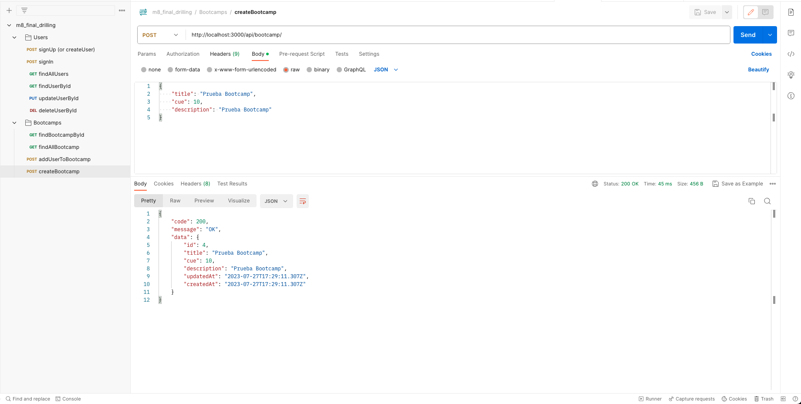
